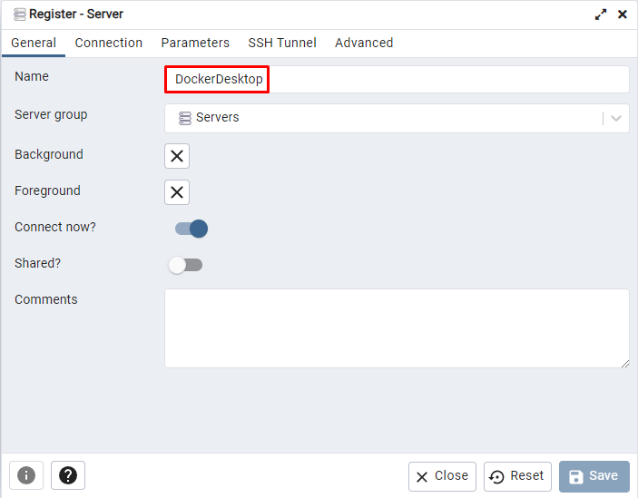

# Docker Desktop

## Prerequisites

- Java version 17
- Maven
- Docker

## Instructions

- Clone the repository

  - git clone <github_url>

- Change directory

  - cd dockerdesktop

- Start PostgreSQL and PGAdmin

  - docker-compose up -d

- Open [PGAdmin](http://localhost:8888)

- Login to PGAdmin (password = mysecretpassword) <br>
  

- Add new server to PGAdmin <br>
  

- Give a name to the server <br>
  

- Provide connection details <br>
  

- Open query tool <br>
  

- Create the database tables <br>

```sql
CREATE TABLE container_instances (
    id VARCHAR(64) PRIMARY KEY,
    image VARCHAR(50) NOT NULL,
    name VARCHAR(50) NOT NULL
);

CREATE TABLE container_metrics (
    id SERIAL PRIMARY KEY,
    measurement_timestamp TIMESTAMP NOT NULL,
    cpu_percent NUMERIC(10, 2) NOT NULL,
    memory_percent NUMERIC(10, 2) NOT NULL,
    container_instance_id VARCHAR(64) REFERENCES container_instances(id) ON DELETE CASCADE
);
```


- Change directory

  - cd monitor

- Build the project

  - mvn clean package

- Execute monitor application

  - java -jar target/monitor-1.0-SNAPSHOT-jar-with-dependencies.jar

- Open new terminal inside the /api folder

- Build the project

  - mvn clean package

- Execute api application

  - java -jar target/api-0.0.1-SNAPSHOT.jar

- Open [Swagger](http://localhost:8080/swagger-ui/index.html)
